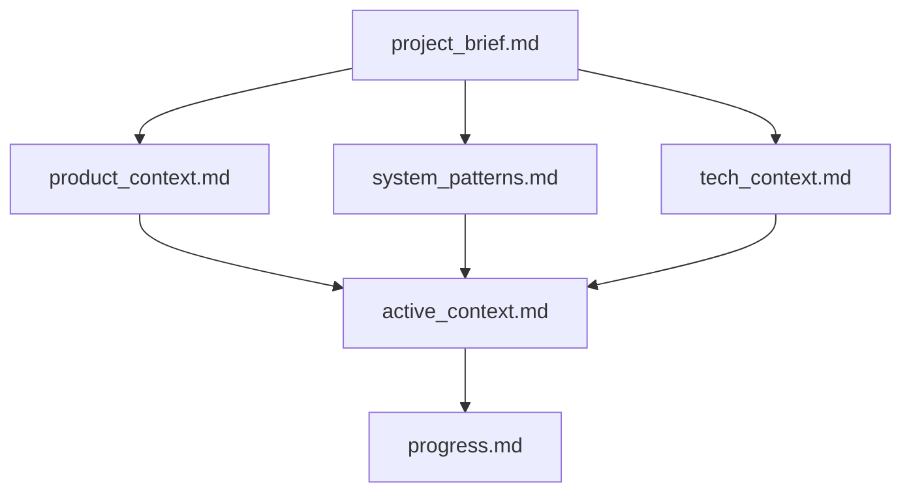

# Coding agent memory bank Structure

## memory bank Overview

The memory bank consists of core files and optional context files, all in Markdown format. Files build upon each other in a clear hierarchy:

## Core Files (Required)

0. **`refined_requirements.md`** (Located in `.ai_dev/requirements/`)
   - Contains refined, actionable requirements from the Requirements Agent.
   - This file is the primary source for new development tasks.
   - (The workflow for checking and clearing this file is detailed in `coding_agent_workflow.md`.)

1. **`project_brief.md`**
   - Foundation document that shapes all other files
   - Created at project start if it doesn't exist
   - Defines core requirements and goals
   - Source of truth for project scope

2. **`product_context.md`**
   - Why this project exists
   - Problems it solves
   - How it should work
   - User experience goals

3. **`active_context.md`**
   - Current work focus
   - Recent changes
   - Next steps
   - Active decisions and considerations
   - Important patterns and preferences
   - Learnings and project insights

4. **`system_patterns.md`**
   - System architecture
   - Key technical decisions
   - Design patterns in use
   - Component relationships
   - Critical implementation paths

5. **`tech_context.md`**
   - Technologies used
   - Development setup
   - Technical constraints
   - Dependencies
   - Tool usage patterns

6. **`progress.md`**
   - What works
   - What's left to build
   - Current status
   - Known issues
   - Evolution of project decisions

## Additional Context

Create additional files/folders within `.ai_dev/memory_bank/` when they help organize:

- Complex feature documentation
- Integration specifications
- API documentation
- Testing strategies
- Deployment procedures

## Documentation Updates

memory bank updates occur when:

1. Discovering new project patterns
2. After implementing significant changes
3. When user requests with **update memory bank** (MUST review ALL files)
4. When context needs clarification

Note: The specific procedure for the **"update memory bank"** command, including reviewing all files and focusing on `active_context.md` and `progress.md`, is detailed in `coding_agent_workflow.md`.
