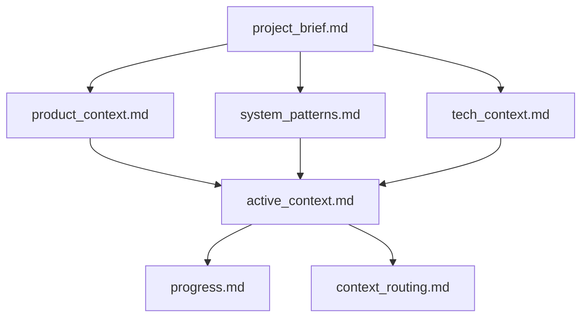

# Coding agent memory bank Structure

## memory bank Overview

The memory bank consists of core files and optional context files, all in Markdown format. Files build upon each other in a clear hierarchy:

## Core Files (Required)

0. **`refined_requirements.md`** (from `.ai_dev/requirements/`)
   - Check this FIRST for any new development tasks
   - Contains refined, actionable requirements
   - If present with content, prioritize implementing these requirements
   - Clear this file after implementation is complete

1. **`project_brief.md`**
   - Foundation document that shapes all other files
   - Created at project start if it doesn't exist
   - Defines core requirements and goals
   - Source of truth for project scope

2. **`product_context.md`**
   - Why this project exists
   - Problems it solves
   - How it should work
   - User experience goals

3. **`active_context.md`**
   - Current work focus
   - Recent changes
   - Next steps
   - Active decisions and considerations
   - Important patterns and preferences
   - Learnings and project insights

4. **`system_patterns.md`**
   - System architecture
   - Key technical decisions
   - Design patterns in use
   - Component relationships
   - Critical implementation paths

5. **`tech_context.md`**
   - Technologies used
   - Development setup
   - Technical constraints
   - Dependencies
   - Tool usage patterns

6. **`progress.md`**
   - What works
   - What's left to build
   - Current status
   - Known issues
   - Evolution of project decisions

7. **`context_routing.md`** (NEW)
   - Maps current tasks to relevant knowledge base files
   - Example: "When parsing DART files: READ .ai_dev/knowledge_base/domain/dart_filings/"
   - Maintained by Knowledge agent based on current work

## Additional Context

Create additional files/folders within `.ai_dev/memory_bank/` when they help organize:

- Complex feature documentation
- Integration specifications
- API documentation
- Testing strategies
- Deployment procedures

## Documentation Updates

memory bank updates occur when:

1. Discovering new project patterns
2. After implementing significant changes
3. When user requests with **update memory bank** (MUST review ALL files)
4. When context needs clarification

Note: When triggered by **update memory bank**, I MUST review every memory bank file, even if some don't require updates. Focus particularly on `active_context.md` and `progress.md` as they track current state.
