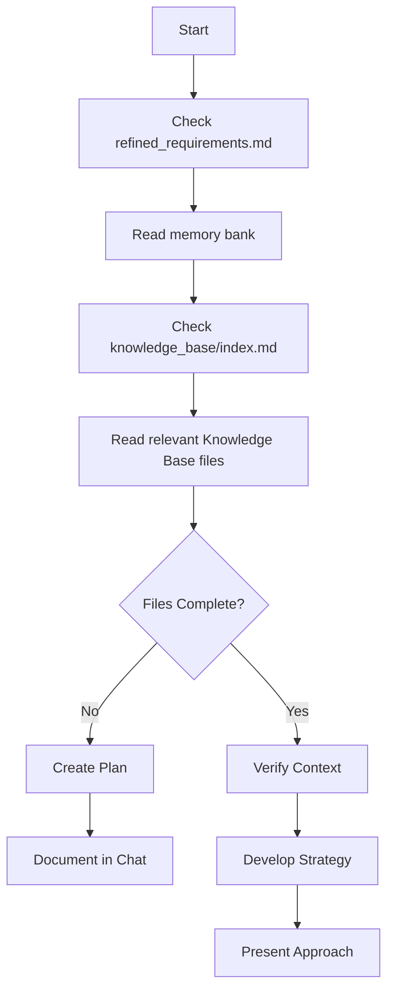
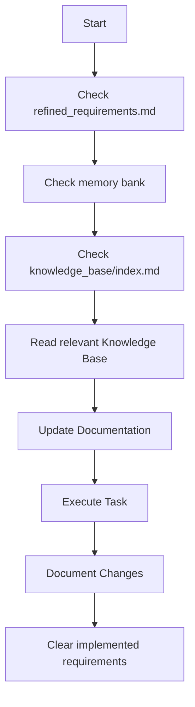
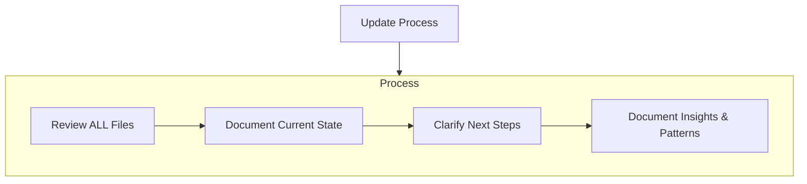

# Coding agent Workflows

## Core Workflows

### Chat Mode Workflow

### Write Mode Workflow

## Update Process

When updating memory bank documentation:

## Workflow Guidelines

### Starting a New Task

1. **Check `.ai_dev/requirements/refined_requirements.md` FIRST**:

    * This file contains refined, actionable requirements from the Requirements Agent.
    * If it has content, implementing these requirements becomes your primary task.
    * (This file should be cleared after successful implementation, as detailed in 'Completing Tasks'.)

2. **Read ALL memory bank files in `.ai_dev/memory_bank/`**:

    * Begin with `project_brief.md` to understand the project's foundational goals.
    * Thoroughly review `active_context.md` to grasp the current work focus, recent changes, and active decisions.
    * Examine `progress.md` to understand what has been completed and what remains.
    * Consult other memory bank files (`product_context.md`, `system_patterns.md`, `tech_context.md`, etc.) to build a complete understanding of the project's context, patterns, and technical landscape.

3. **Consult `.ai_dev/knowledge_base/index.md`**:

* This index, maintained by the Knowledge Agent, is your primary guide to the Knowledge Base.
* Identify and read the relevant files and sections within `.ai_dev/knowledge_base/` as indicated by the index and current task requirements before commencing work.

### During Development

1. **Make incremental changes**:

    * For modifying existing files, always try to make incremental edits to ensure changes are trackable (e.g., via git-diff) and to avoid accidental data loss.
    * Commit logical chunks of work.

2. **Update documentation as you work**:

    * Document significant decisions in `active_context.md`
    * Update `progress.md` when features are complete

3. **When encountering new patterns**:

    * Document in memory bank
    * Suggest Knowledge Base updates to user

### Completing Tasks

1. **Update `progress.md`**:

    * Clearly mark all completed features or tasks.
    * Document any new issues, bugs, or limitations discovered during implementation.

2. **Clear `.ai_dev/requirements/refined_requirements.md`**:

    * Remove the requirements that have been fully implemented and verified.
    * If a requirement was only partially implemented, make a note of the partial status within `progress.md` or `active_context.md` and discuss with the user whether the remaining part of the requirement should persist or be re-evaluated. Do not clear partially implemented requirements without explicit confirmation or a new refined requirement covering the remainder.

3. **Update `active_context.md`**:

    * Summarize what was accomplished in the completed task.
    * Outline the next logical steps or potential follow-up tasks.

### Special Workflow: "Update memory bank" Command

When the user explicitly issues an "update memory bank" command, follow this specific procedure:

1. **Systematically Review EVERY File in `.ai_dev/memory_bank/`**:

    * Read each file thoroughly, even if you believe some may not require immediate updates.
    * Pay particular attention to `active_context.md` and `progress.md`, as these are critical for tracking the current state and evolution of the project.

2. **Document the Current Project State Accurately**:

    * In `active_context.md`: Detail recent significant changes, ongoing work, and immediate next steps.
    * In `progress.md`: Reflect the latest status of features, tasks, and any known issues.
    * Ensure other memory bank files (`project_brief.md`, `product_context.md`, `system_patterns.md`, `tech_context.md`) are consistent with the current understanding of the project.

3. **Capture and Document Insights and Patterns**:

    * Record any new technical learnings, architectural insights, or design patterns that have emerged in the appropriate memory bank files (e.g., `system_patterns.md`, `tech_context.md`, or a dedicated new file if substantial).
    * Document any significant design decisions and their rationale in `active_context.md` or a relevant decisions log if one exists.
    * Note any observations about process improvements or challenges.
