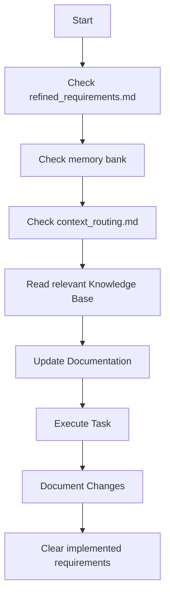
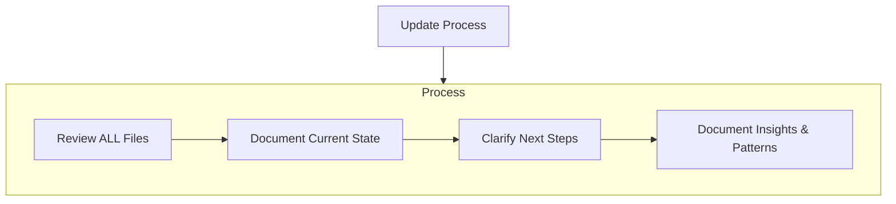

# Coding agent Workflows

## Core Workflows

### Chat Mode Workflow

### Write Mode Workflow

## Update Process

When updating memory bank documentation:

## Workflow Guidelines

### Starting a New Task

1. **Always check `refined_requirements.md` FIRST**
   - This contains refined requirements from the Requirements Agent
   - If it has content, this is your primary task
   - Clear it after implementation

2. **Read ALL memory bank files**
   - Start with `project_brief.md` for foundation
   - Review `active_context.md` for current state
   - Check `progress.md` for what's completed

3. **Consult `context_routing.md`**
   - This guides you to relevant Knowledge Base files
   - Read indicated files before starting work

### During Development

1. **Make incremental changes**
   - Use `edit_file` for trackable modifications
   - Commit logical chunks of work

2. **Update documentation as you work**
   - Document significant decisions in `active_context.md`
   - Update `progress.md` when features are complete

3. **When encountering new patterns**
   - Document in memory bank
   - Suggest Knowledge Base updates to user

### Completing Tasks

1. **Update `progress.md`**
   - Mark completed features
   - Note any new issues discovered

2. **Clear `refined_requirements.md`**
   - Remove implemented requirements
   - Note any partial implementations

3. **Update `active_context.md`**
   - Document what was done
   - Note next logical steps

### Special: "Update memory bank" Command

When user explicitly says **"update memory bank"**:

1. **Review EVERY memory bank file**
   - Even if some don't need updates
   - Focus on `active_context.md` and `progress.md`

2. **Document current project state**
   - Recent changes
   - Current challenges
   - Next steps

3. **Capture insights and patterns**
   - Technical learnings
   - Design decisions
   - Process improvements
